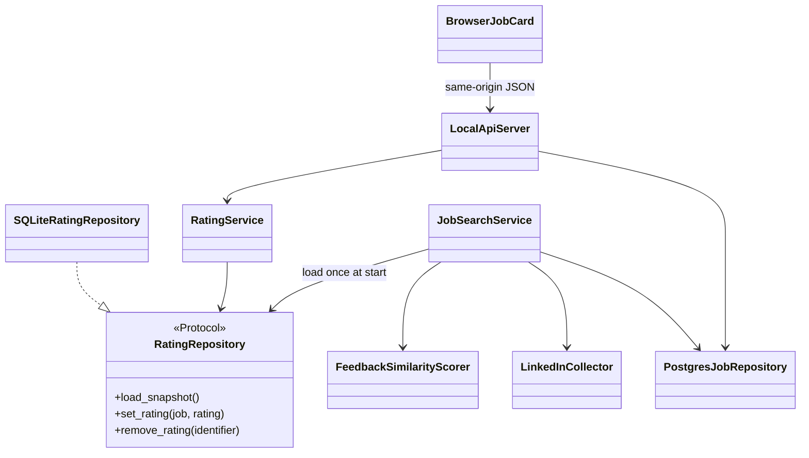

# Job Feedback Architecture

## 1. Problem solved

Job cards previously supported only a synchronous PostgreSQL favorite action. There was
no durable positive/negative training signal that the scraper could use to reject jobs
similar to openings the user had disliked.

## 2. Background context

The existing PostgreSQL database remains responsible for resumes, current search
results, and legacy favorites. Feedback is a separate local concern that must remain
available without a remote service and must be safe to access from the desktop worker,
the scraper, and a localhost API. LinkedIn's `data-entity-urn` posting identifier remains
the canonical job identity; legacy records receive a deterministic, non-PII hash.

## 3. Decision taken

Feedback domain values and repository ports live under `jobfinder.feedback`. The
`SQLiteRatingRepository` implements those ports with one connection per operation, WAL
mode, a busy timeout, parameterized values, and an immediate transaction that makes
positive and negative ratings mutually exclusive. It creates exactly two local tables:
`great_jobs_openings` and `bad_jobs_openings`, each containing `id`, `title`,
`description`, `location`, and `created_at`.
SQLite lock waits are restricted to greater than zero and at most 60 seconds, and posting
HTTP timeouts to greater than zero and at most 30 seconds, preventing invalid
configuration from disabling the bounded-failure guarantees.

`ML.feedback.FeedbackSimilarityScorer` batches spaCy processing and computes the maximum
similarity to each rating set. Each pair uses the required field weights: 60 percent
description, 30 percent title, and 10 percent location. Exact normalized fields score
one; spaCy vectors provide semantic similarity; installations without vectors fall back
to deterministic token overlap. The feedback filter is marked inactive until at least
25 total ratings exist.

At the beginning of every `JobSearchService.run`, both rating tables are loaded into one
immutable snapshot. When the threshold is active, negative-feedback filtering runs
before resume compatibility scoring. The PostgreSQL job adapter now persists the stable
source identifier and provides read methods for presentation adapters without exposing
database cursors or SQL outside infrastructure code.

## 4. Consequences

Rating persistence is local, testable with a temporary SQLite file, and independent of
PostgreSQL and the presentation layer. Changing a rating cannot leave the same ID in
both tables. Similarity performs one batched encoding pass per field instead of invoking
spaCy for every job/rating pair. The SQLite file contains job-opening text but no resume,
account credential, or user profile data; it belongs in the per-user application data
directory and must not be committed.
Existing PostgreSQL installations receive an additive `source_id` column; the current
jobs table remains the source for displayed search results.

### Local browser boundary

#### 1. Problem solved

The native card UI could not satisfy browser accessibility, CSS arrow animation, or a
front-end-neutral API. A casually exposed localhost server would also be vulnerable to
cross-site requests and DNS-rebinding techniques.

#### 2. Background context

The browser needs only current jobs plus a way to set or clear a rating. It must never be
trusted to submit the title, description, or location that SQLite stores.

#### 3. Decision taken

`UI.api.LocalApiServer` binds to `127.0.0.1` on an ephemeral port. It accepts only exact
GET, PUT, and DELETE routes; validates the loopback peer and exact Host header; rejects
transfer encoding, oversized bodies, unsupported media, unexpected fields, methods,
queries, and origins; and limits request rate and concurrent workers. A random
HttpOnly/SameSite session cookie protects API reads, while writes also require the exact
per-process Origin. No CORS access is granted. Rating requests contain only `great` or
`bad`; the server reloads the canonical job before writing. Responses add restrictive
CSP, framing, MIME-sniffing, referrer, resource, and permissions headers.

Static cards use semantic buttons, visible focus, `aria-pressed`, `aria-expanded`, a live
status region, and a CSS-rotated arrow. JavaScript writes untrusted database strings only
through `textContent` and permits only HTTP(S) posting links.

#### 4. Consequences

Other devices cannot connect, hostile websites cannot read responses or issue
authenticated writes, and malformed requests are closed after a generic error. The
ephemeral address changes each run and must be opened from the desktop application.
Local processes running as the same operating-system user remain outside this HTTP
threat boundary and must be controlled through normal OS account security.

### Native desktop integration

#### 1. Problem solved

The existing favorite star performed synchronous PostgreSQL work and did not provide
the positive/negative feedback required by the new filter. Legacy favorites also lost
the full description and stable source identifier.

#### 2. Background context

CustomTkinter must only be changed from its main thread. SQLite writes are short but can
still wait for a lock, so invoking them directly from a button callback would make the
window temporarily unresponsive.

#### 3. Decision taken

The desktop composition root owns one `RatingService`, a two-worker executor, and the
localhost server. Cards optimistically update thumb state, submit the SQLite transaction
to the executor, and marshal completion back through `after`; failures restore the prior
state. Great and bad states are mutually exclusive. Enter and Space bindings are added
to the rating and description controls. A top-bar button opens the ephemeral browser
URL. Closing the window stops the API and cancels pending UI work.

The additive PostgreSQL migration carries `source_id` and `description` into legacy
favorites. Home and favorite views load rating status once per view rather than opening
SQLite for every rendered card.

#### 4. Consequences

Rating actions do not block Tk's event loop and both front-ends share exactly the same
local feedback. The legacy favorite star remains a separate PostgreSQL concept. If
SQLite or the localhost socket is unavailable, the desktop still starts with feedback
or the browser button disabled and records only a non-sensitive exception type.

### Logging and failure containment

#### 1. Problem solved

The desktop did not configure the required file log, while several older paths logged
filesystem locations, complete exception messages, URLs, or tracebacks that could expose
local names or resume-derived search terms.

#### 2. Background context

Operational diagnosis needs event type, posting identifier, count, score, and duration;
it does not need resume text, job descriptions, credentials, user paths, or raw browser
errors.

#### 3. Decision taken

All application entry points use INFO-level `logs/app.log` configuration. If that file
cannot be created, logging falls back to a null handler so logging itself cannot prevent
startup. Expected failure paths now record sanitized operation names and exception class
names. UI callback and top-level startup failures are contained and shown as generic
messages.

#### 4. Consequences

Routine events and safe identifiers remain diagnosable without writing PII. Detailed
third-party exception text and tracebacks are intentionally absent, so deeper debugging
requires reproducing a failure in a controlled development environment.

### Bounded posting collection

#### 1. Problem solved

The collector opened one Playwright page per posting and waited a fixed 1.5 seconds to
discover its public URL. One hundred successful postings therefore spent at least 150
seconds waiting before navigation and NLP costs.

#### 2. Background context

LinkedIn search cards and their `data-entity-urn` codes remain the required discovery
mechanism. Once those codes are known, the existing guest-posting endpoint returns the
title, company, location, description, logo, and public title link as HTML.

#### 3. Decision taken

Playwright remains responsible for loading the search result and collecting card codes.
After the browser closes, a bounded pool of at most 16 workers retrieves guest-posting
HTML with a five-second request timeout. BeautifulSoup parses the same CSS classes, and
the public URL is read directly from the title anchor. Completed responses are restored
to card-code order before deterministic title deduplication and blacklist filtering.

#### 4. Consequences

The fixed per-posting browser wait is removed and slow postings no longer serialize the
batch. Concurrency is capped to protect local resources; individual HTTP or parsing
failures are logged by identifier and skipped. Live elapsed time still depends on
LinkedIn latency and throttling, so CI measures the collector with a local fixture and
keeps live LinkedIn verification as a separate smoke test.

### Verification configuration

#### 1. Problem solved

Plain pytest discovery depended on launcher-specific import behavior, coverage tooling was
absent, and runtime databases, logs, and coverage output could appear as commit noise.
The documentation directory itself was also ignored.

#### 2. Background context

The project must produce repeatable Python 3.12 CI results and at least 80 percent unit
coverage while keeping generated or sensitive local data out of Git.

#### 3. Decision taken

`pytest.ini` fixes test roots, disables cache writes, and declares browser/performance
markers. A fixture places unique SQLite files directly in the existing ignored
test-runtime directory, avoiding system-temporary ACL differences on managed Windows.
`pytest-cov` is pinned with the existing test dependencies. Additive `.gitignore` rules
cover virtual environments, logs, SQLite sidecars, pytest and coverage output; negated
patterns make required Markdown architecture decisions committable without removing any
existing ignore rule. Five historical `.pyc` files were removed from Git's index while
their ignored local copies were left alone. The requirements file was mechanically
normalized from UTF-16 to UTF-8 before adding the dependency.

#### 4. Consequences

Local and CI commands share one discovery configuration, generated feedback data cannot
be staged accidentally, and architecture records can accompany code commits. The
requirements encoding change is non-semantic but makes standard Python and patch tools
handle the file consistently.

### Feedback verification suite

#### 1. Problem solved

The new persistence, similarity, HTTP security, asynchronous browser behavior, and
collector concurrency introduced failure modes that the legacy 16-test suite did not
exercise.

#### 2. Background context

Routine tests must remain independent of PostgreSQL, LinkedIn, user application data,
and paid or hosted services. Browser runtimes are heavier and should run explicitly in
CI rather than making every local unit invocation launch a browser.

#### 3. Decision taken

Temporary SQLite tests verify exact schemas, positive-to-negative transitions, clearing,
concurrent writers, and non-PII legacy IDs. NLP tests cover 24/25 rating behavior, the
exact 60 percent boundary, independent set maxima, validation, and a 100-by-25 local
benchmark. Scraper tests use fixture HTML to verify card order, direct public links,
deduplication, blacklisting, bounded concurrency, and request settings. Service tests
prove one snapshot load and pre-resume rejection.

An acceptance-level local integration collects and parses 100 fixture postings, compares
them with 25 disliked jobs, requires at least 90 percent of those dislikes to be omitted,
and enforces the complete collection-plus-feedback budget of less than 60 seconds.

Live loopback integration tests exercise session cookies, Host and Origin checks,
methods, routes, payload allowlists, CORS absence, security headers, rating transitions,
and server-side canonical job lookup. An opt-in Playwright test uses keyboard Enter and
Space to expand a description and persist a dislike without navigation; CI selects
Firefox, Chrome, and Edge explicitly.

#### 4. Consequences

The fast default suite stays offline and browser-independent, while `--run-browser`
activates end-to-end rendering. Test doubles retain the real API, SQLite, HTML parser,
and scoring boundaries without depending on live external state.

### CI, packaging, and launch path

#### 1. Problem solved

The batch launcher invoked the new offline JSON CLI without required arguments, the
PyInstaller specification omitted browser assets, and no CI gate exercised Python 3.12,
coverage, or the three accepted browsers.

#### 2. Background context

Runtime requirements contain large optional research packages and language models that
are unnecessary for deterministic tests. GitHub Windows runners already provide Chrome
and Edge, while Playwright can install its matching Firefox runtime.

#### 3. Decision taken

`JobFinder.bat` now starts `UI/main.py`. Packaging recipes and generated executables are
kept local because a machine-specific build may embed configuration. A local recipe must
package the static browser directory and existing native images. A pinned minimal
`requirements-ci.txt` installs only modules imported by tests
and startup smoke checks, including spaCy's CLI-level `click` import that is not declared
by the selected wheel's dependency metadata.

The Windows CI workflow uses Python 3.12, imports the desktop composition root, runs the
offline suite with an 80 percent coverage gate over every new or materially changed
feedback/scraping/API module, and executes the browser integration separately in
Firefox, Chrome, and Edge. Workflow permissions are read-only.

#### 4. Consequences

The normal launcher and packaged executable can find the local browser page. CI avoids
unrelated multi-gigabyte dependencies while still validating all runtime imports used by
this feature. Coverage intentionally targets the changed clean-architecture surface;
the legacy CustomTkinter composition file remains an integration/manual-test surface
rather than being used to dilute or inflate the feature percentage.

The root README now reflects the dual PostgreSQL/SQLite model, feedback flow, hardened
loopback boundary, Python 3.12 support, and verification command so setup guidance does
not contradict this decision record.

### Responsive desktop startup from the UI directory

#### 1. Problem solved

Running `cd UI` followed by `python main.py` could leave the process without a visible
CustomTkinter window. Home-screen construction queried PostgreSQL twice and downloaded
each company logo synchronously before Tk entered its event loop, so an unavailable
database, offline network, or several slow logo responses prevented the first paint.

#### 2. Background context

`JobFinderApp.__init__` builds the home screen before `mainloop()` starts. The legacy
home builder mixed widget creation with external I/O, and launching from inside `UI/`
appended the repository root behind installed packages in `sys.path`. The top-level
exception guard also returned a failure code without presenting a terminal or dialog
message, which made environment-specific startup failures look like a silent exit.

#### 3. Decision taken

The repository root is now inserted first for the legacy `UI/main.py` entry path. The
initial PostgreSQL read is submitted once to the existing bounded UI executor, polled
from Tk's main thread, and limited by a five-second connection timeout. Cards render an
immediate initials placeholder while a separate four-worker image pool fetches optional
logos. Logo requests require HTTPS on a `licdn.com` host, reject redirects and non-image
responses, use finite connect/read timeouts, and stop after two MiB.

Before entering the event loop, the composition root explicitly finalizes geometry,
deiconifies, and raises the window. Startup logging always targets the root-level
`logs/app.log`; a contained startup exception now produces a generic terminal and dialog
message without logging credentials or job data. Both worker pools are cancelled during
normal shutdown. Because `CTkButton` rejects Tk's `takefocus` constructor option, card
buttons receive a single canvas-level tab stop after construction and draw a contrasting
border on focus. Regression tests cover repository-local package resolution from the
`UI` working directory, window lifecycle order, PostgreSQL timeout configuration, the
logo-request allowlist and size boundary, and the supported CustomTkinter focus hook.

#### 4. Consequences

The desktop frame becomes visible independently of PostgreSQL and internet latency, and
offline use shows stable initials instead of freezing on missing logos. Job rows and
approved logos populate asynchronously when available. Tk widget updates remain on the
main thread, rating writes cannot queue behind logo downloads, and invalid or oversized
logo URLs cause only the placeholder to remain. Keyboard users retain Enter/Space card
actions without triggering a card-render callback exception. The five-second database
timeout applies to each background connection attempt rather than blocking application
startup.
